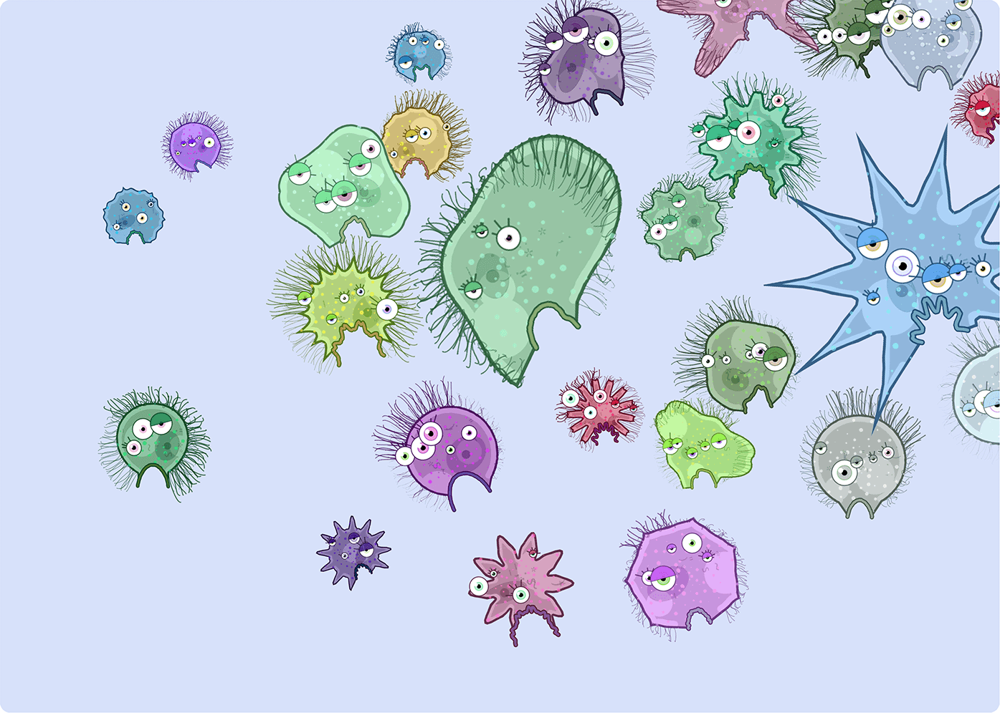

# Digital Aquatics

*A Processing.py adaption of Lieven Menschaert's Nodebox script, ["Aquatics!"](https://www.nodebox.net/code/index.php/Aquatics)*

The script implements Johan Gielis' Superformula equations, generating a new microbial beastie with each run.

